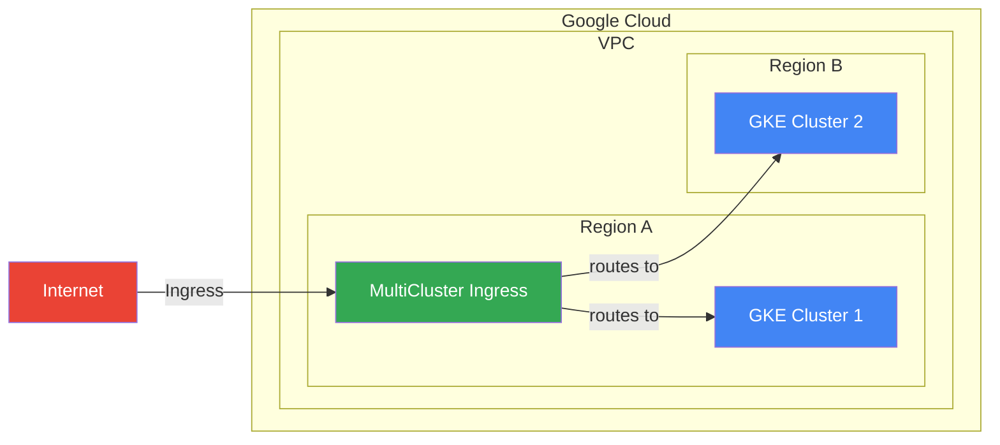

# Multi Cluster Ingress - MCI

Example MCI deployment.

## todo
- [~] Terraform
    - [ ] project w/ org attachment
    - [x] network
    - [x] control plane cluster
    - [ ] iap configuration
- [ ] cluster configuration
    - [ ] basic ingress configuration
    - [ ] config connector installation
    - [ ] workload cluster provisioning
    - [ ] gitops
    - [ ] weight-based multi-cluster ingress
    - [ ] l4/l7 service routing
- [ ] misc.
    - [ ] service installation

